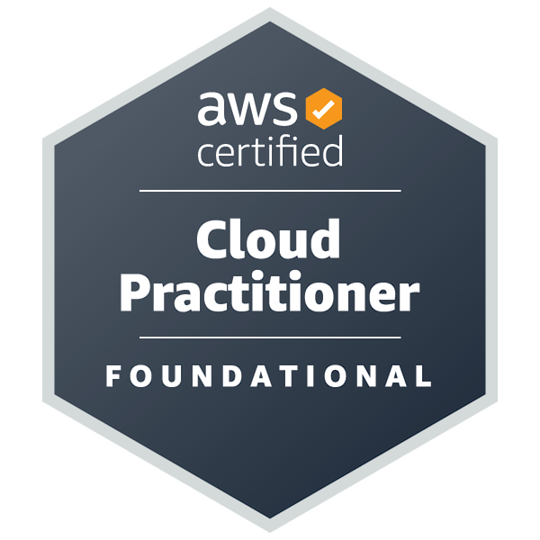

<!-- Add Google Fonts Link -->
<link href="https://fonts.googleapis.com/css2?family=Inter&display=swap" rel="stylesheet">
<link rel="stylesheet" href="styles.css">

<body>

  # Welcome to My GitHub Profile! 👋
  
  - Hey everyone! I'm Artur, a coding enthusiast and currently a student pursuing Analysis and Systems Development.
  
  ## 📚 About Me
  
  - 🔭 **Currently:** Diving deep into the Analysis and Systems Development program as a dedicated student at FATEC Taubaté.
  - 💼 **Interning at:** Johnson&Johnson. Working with Data & Analytics technologys.
  - 📘 **Educational Path:** My journey started when I discovered my passion for programming during my time at UNIFEI, where I pursued Control and Automation Engineering for three semesters.
  - 🆙 **Experience:** Intern at Compass.UOL wich I had the opportunity to learn about Machine Learning using AWS services.
  
  ## 🌐 Let's Connect
  
  - You can reach me at my personal email: [arturguimaraes.sk8@gmail.com](mailto:arturguimaraes.sk8@gmail.com). You can also connect with me on [LinkedIn](https://www.linkedin.com/in/artur-guimar%C3%A3es-174300262/).
  
  ## 🧑 Pronouns
  
  - He/him.
  
  ## 🛠 My Toolbox
  
  Here's some tools, skills, and methodologies I've been working with:
  
  - **Languages:** `C` | `C#` | `JavaScript` | `Node.JS` | `Python` | `SQL`
  - **Cloud:** `AWS`
  - **Version Control:** `Git & GitHub`
  - **Virtualization:** `Docker`
  - **Project Management:** `Agile` with a touch of `Scrum`
  - **Cloud Development**: `Serverless`
  - **Machine Learning**: `Amazon SageMaker`
  - **Computacional Vision**: `Amazon Rekognition`
  - **Database**: `DynamoDB`
  
  Looking forward to entering the IT professional world and making meaningful contributions!
  
  Thanks for stopping by. It means a lot!
  
  Artur
  ## Certification badges
  

    
  

</body>
